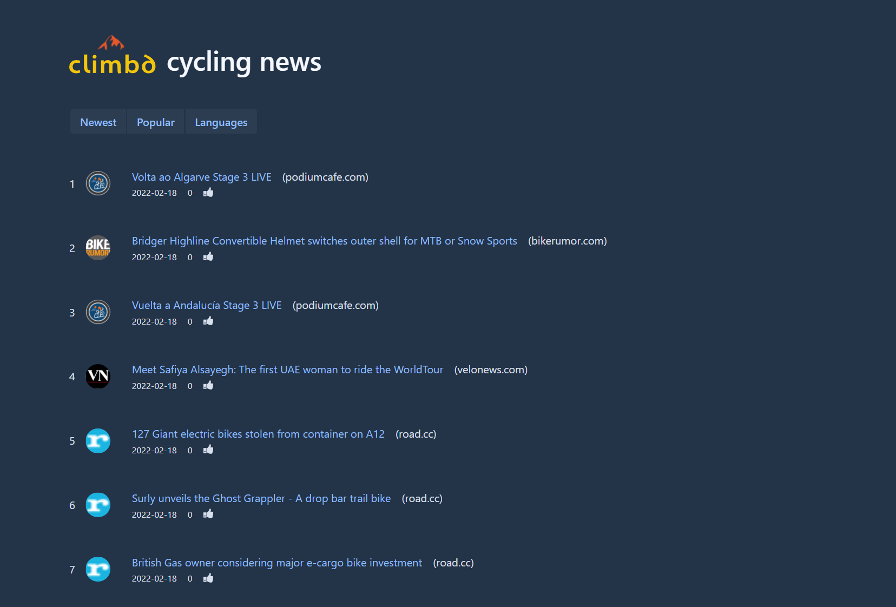

# Climbd Cycling News


Live deployment (if configured): https://news.qfotografie.de



This is a "Hacker News" clone for cycling-related content. Content entries are automatically created from RSS feeds.

The project uses Vaadin (Flow + React components) for the UI. The backend uses Spring Boot with MongoDB for persistence.

## Architecture Overview

- UI: Vaadin views (`src/main/java/ch/climbd/newsfeed/views`) rendered by Spring Boot.
- API/controllers: REST-style endpoints, SEO helpers, and admin actions in
  `src/main/java/ch/climbd/newsfeed/controller`.
- Ingestion: a scheduled RSS processor (Rome) pulls feeds and stores entries in MongoDB.
- Data: Spring Data MongoDB stores `NewsEntry` documents.
- Integrations: optional Pushover notifications, YouTube transcript lookup, and Spring AI for enrichment.

## Setup

Start from `src/main/resources/example-application.yaml` and rename it to `src/main/resources/application.yaml` or
`src/main/resources/application-local.yaml`
(used by the `local` Spring profile). Adjust MongoDB credentials, RSS/AI settings, and optional Pushover keys.

Set the Maven profile to `dev` for development and `production` for releases.

Run the app like a normal Spring Boot application, for example:

```bash
./mvnw -Pdev spring-boot:run
```

The frontend is available at http://localhost:8080.
